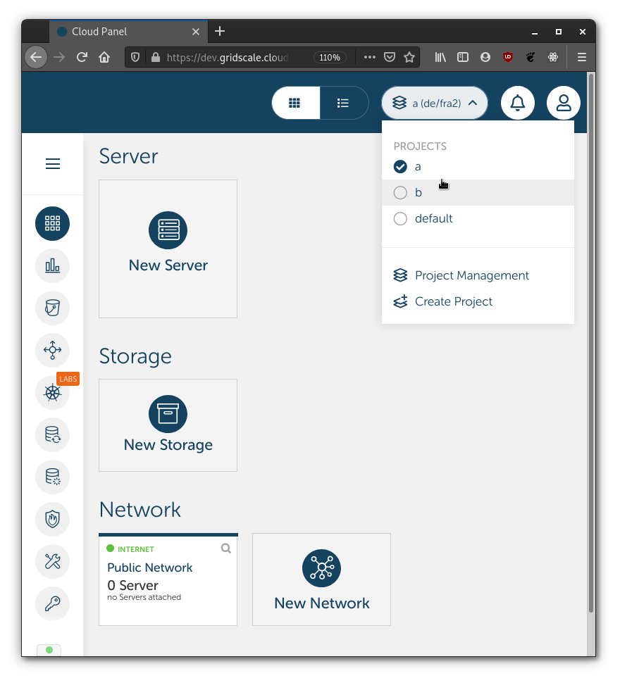

# Multi-project example

This example shows how you can leverage gridscale multi-project feature with Terraform.

In case you don't know already, you can easily create multiple projects beside the standard "default" project.



Projects allow you to scope your objects and easily control resource usage. For example, with a project you can just throw away all resources within that project all at once to make sure you don't pay for something you don't use.

Once you have created a new project, you can create a new API token within that project. API tokens are limited to the scope of the project they are defined in. Different project, different API token.

When you run Terraform, you just need to set the `GRIDSCALE_TOKEN` environment variable to the value of the token for the specific project. This will make sure that all operations Terraform executes are limited to the corresponding project.

## Example

This example shows two projects, "a" and "b" split into sub directories.

    ├── project-a
    │   ├── .envrc
    │   └── example.tf
    ├── project-b
    │   ├── .envrc
    │   └── example.tf
    └── README.md

Each directory contains a simple text file that can be sourced before running `terraform apply`:

```shell
$ cat project-a/.envrc
export GRIDSCALE_TOKEN=project-a-api-token
export GRIDSCALE_URL=https://api.gridscale.io
export GRIDSCALE_UUID=your-user-id
```

```shell
$ cat project-b/.envrc
export GRIDSCALE_TOKEN=project-b-api-token
export GRIDSCALE_URL=https://api.gridscale.io
export GRIDSCALE_UUID=your-user-id

```

Tip: you can use tools such as direnv(1) to easily switch between environment variables.
